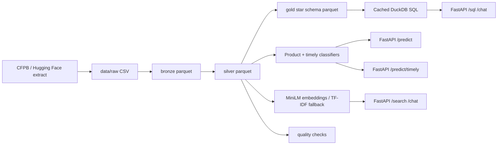
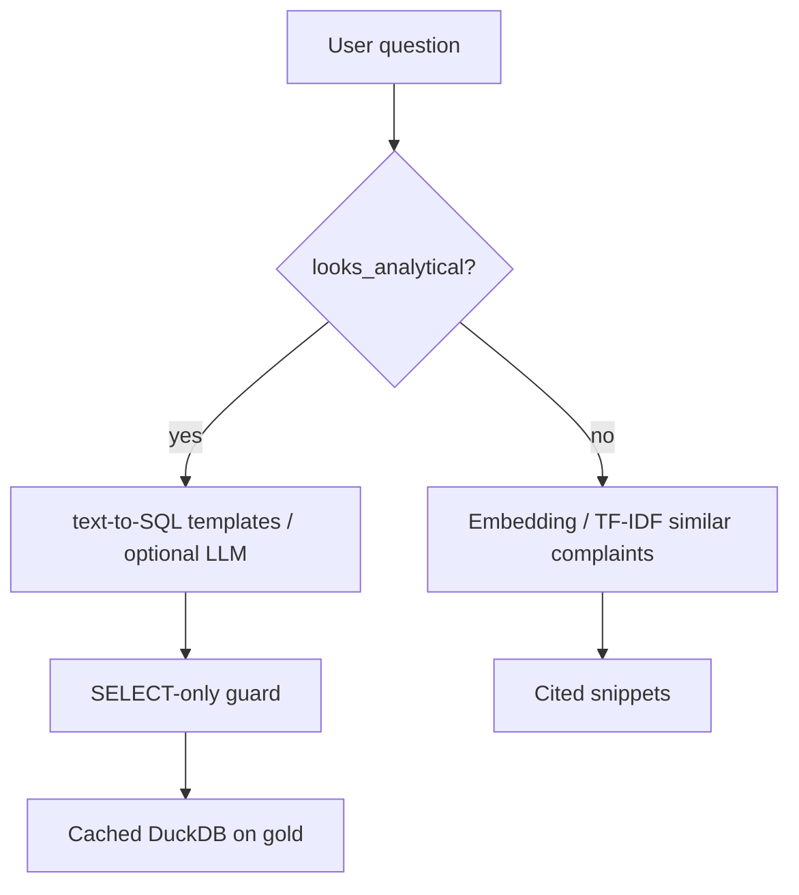

# Architecture

## Stack

| Concern | Implementation |
|---|---|
| Landing | `data/raw` |
| Bronze / silver / gold | Parquet under `data/` |
| SQL engine | Cached DuckDB over gold |
| Model tracking | MLflow (local SQLite) |
| Serving | uvicorn / Docker |
| Retrieval | MiniLM embeddings (joblib); TF-IDF fallback |

## Gold star schema

**Fact:** `fact_complaints` (grain = one complaint)

**Dims:** `dim_company`, `dim_product`, `dim_issue`, `dim_geo`, `dim_channel`, `dim_date`

DDL: `sql/01_star_schema.sql`  
Analytics: `sql/02_analytical_queries.sql`  
Quality: `etl/quality.py`

## Request routing

## Security notes

- Text-to-SQL rejects multi-statement and DML/DDL verbs before execution.
- Optional `OPENAI_API_KEY` only proposes SQL; the same guard still applies.
- `.env`, raw dumps, and `.joblib` model binaries are gitignored.
